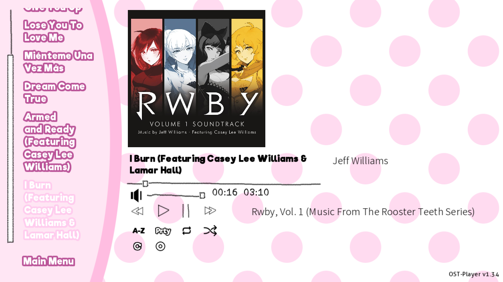
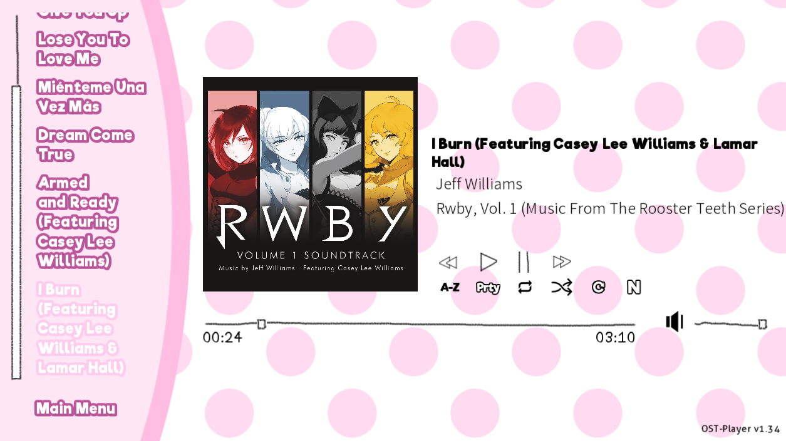

# DDLC OST-Player

A heavily revamped version of Nikso's Soundtrack Player for DDLC. <u>Current Version:</u> [**2.2**](https://github.com/GanstaKingofSA/DDLC-OSTPlayer/releases/latest)

<p align="center">
    
   
</p>

**DISCLAIMER:** This is not afiliated or endorsed by Team Salvato or Nikso. The Scattered Stars <u>Logo</u> in `Wake Up Unchanged` is not free to use, but is only allowed in this build as a display to the soundtrack player. If you plan to use this, remove it in your final build.

> All songs featured above are owned by the developer and are not included in DDLC OST-Player. (Shoo UMG, SME, Rooster Teeth and all other music labels.)

## Credits

- Nikso - Original Developer
- Sam Kujo#9403 - Original Design and Beta Tester
- Staryxz#3613 - Original Beta Tester
- PabloLuaxerc#1719 - Artist of `Wake Up Unchanged`
- Tom Rothamel - Ren'Py SDK Style Code, Ren'Py File Code and Feedback
- Tom Wallroth - Tinytag Code
- RyzekNoavek#0624 - Adjustable Play Bar Code
- khaase (Pixabay) - Refresh Icon (Prior to Version 2.0)
- eugenialcala (Pixabay) - Replay Icon (Prior to Version 2.0)
- raphaelsilva (Pixabay) - Shuffle Icon (Prior to Version 2.0)
- Josy_Dom_Alexis (Pixabay) - Volume Icon (Prior to Version 2.0)
- Google - Noto Sans SC Font (Author/Description Tag) and Icons (Version 2.0+)
- Ren'Py Discord - Feedback on Ren'Py Universal Player Feats Now In DDLC OST-Player
- Weiss Schnee - Support (Weiss :D)

## What does this do?

This allows the user to play the soundtrack of mods outside the main story, sideload music to play alongside it or for mod authors to automatically add their songs in a custom music room.

## What does this version improve on?

1. Ability to play MP3, OGG, WAV and OPUS files with metadata!
    > Some players will export music files differently than normal. Make sure your tracks are exported properly using your music player or Audacity.
2. Improved music player aesthetic.
3. Dynamic title and font size changes (sort of) and cover art scaling.
4. Sideload songs from your playlist to be played with the mod's tracks.
5. RPA/APK Playback and Metadata Support
   > You will need to enable Developer Mode in order to make the metadata of songs in the track RPA folder generate for distribution.
6. Improved fonts for some languages. See a example [here.](assets/screenshot0006.png)

    > Due to languages and font character limits, the fonts in DDLC OST-Player will not cover all languages. Riffic-Bold will have to be downloaded separately to comply with the FontSpring license.
7. Android Support!

## What do I need to run this?

> This assumes you already have a copy of DDLC with the mod template installed over it.

1. The Latest DDLC OST-Player [ZIP File](https://github.com/GanstaKingofSA/DDLC-OSTPlayer/releases/latest)
   > If you already have Nikso's Audio Player installed in your mod and are upgrading to this one, copy the ZIP contents to your mod's game folder **and** delete the `audio_player.rpy` file from within within `mod_assets`.
2. **(Recommended but Optional)** Riffic-Bold from [Fontspring](https://www.fontspring.com/fonts/inky-type/riffic/riffic-bold) to add more font characters to the program.
   > This font is free, but requires you to make a Fontspring account and have a _Desktop license_ for it in order for you to use this.

## How do I install this?

> This assumes you already have a copy of DDLC with the mod template installed over it.

1. Drop all the contents in this ZIP file into the base folder of DDLC (where `DDLC.exe`/`DDLC.sh` is).
   > If you are on MacOS/OS X, you must right-click DDLC.app and click `Show Package Contents` then navigate to `Contents/Resources/autorun` and drop the ZIP file contents in there.
2. Open *options.rpy* and add the following lines under line `192`
   ```py
   build.classify("game/RPASongMetadata.json", "scripts all")
   build.classify("game/python-packages/**", "mod all")
   ```
3. Copy this line to *screens.rpy* under `textbutton _("Load Game")` and restart DDLC.
   ```py
   textbutton _("Music Room") action [ShowMenu("music_player"), Function(get_music_channel_info), Stop('music', fadeout=2.0), Function(refresh_list)]
   ```
3. **(Recommended but Optional)** Download the `Riffic-Bold` font from [Fontspring](https://www.fontspring.com/fonts/inky-type/riffic/riffic-bold) and copy the `riffic-bold.ttf` in _Fonts_ to `game/mod_assets/music_player`
   - Open *audio_player.rpy* and remove the `#` symbol in front of lines `292` and `299`.
4. Put music in the `track` folder inside the `game` folder and try it out!

## Can I still define songs the old way?

Yes you can. The old format still works however you must add this line after defining it.

```py
manualDefineList.append(Wake_Up_Unchanged)
```

> Change `Wake_Up_Unchanged` to your song variable

Additionally you may use `unlocked` to lock some songs from playing until the player hears it in-game. See *manualtracks.rpy* for a example.

> It is now recommended to move all the manual defines to *manualtracks.rpy* for easier define access versus doing so in *audio_player.rpy*.

## How do I priortize a song or make a song the first one?

Manually define your song and give it a priority value. 0 is the highest priority you can make a song be while 1, 2, etc. will be prioritzed lower in the list. i.e. *0 > 1 > 2 > ...*

## Why is `Riffic-Bold` not included in DDLC OST-Player?

Riffic-Bold is not included in DDLC OST-Player due to licensing issues with Fontspring. In order to install Riffic-Bold you will need to download it yourself as a _Desktop license_ and install it onto your project as listed above in **How do I install this?**

## How do I add metadata info?

Right-click your song, Select Properties -> Details, and fill the blank boxes you can.
Alternatively, use [MusicBee](https://www.getmusicbee.com/) or a similar music player, or [MusicBrainz Picard](https://picard.musicbrainz.org/) and find your song.

- For MusicBee: Right-Click your song within the player, select _Edit_ and edit away the info you want, then click _Apply_ then _OK_.
- For MusicBrainz Picard: Add your song to Picard, select it, right-click the rectangle box that has 3 columns, select _Add New Tag_, select the tags you want to add like _Title_, _Artist_, _Comment_, _Album_, etc. There should be a blank box in the box area below, double-click it and edit away the info you want to add, then click _Save_ and press the _Save_ button near _Info_.

## Why did you do this?

Cause I was bored and wanted to see RWBY songs play within DDLC and see song covers displayed. (Yang _:P_)
