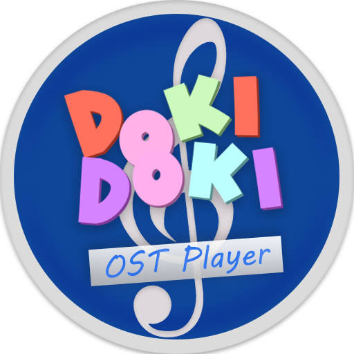

# DDLC OST Player

A heavily revamped version of Nikso's Soundtrack Player for DDLC.

[Download DDLC OST-Player Here!](https://github.com/GanstaKingofSA/DDLC-OSTPlayer/releases/latest)

<p align="center">
    
</p>

**DISCLAIMER:** This is not affiliated nor endorsed by Team Salvato or Nikso. The Scattered Stars <u>logo</u> in `Wake Up Unchanged` is not free to use, but is only allowed in this build as a display to the soundtrack player. If you plan to use the OST Player, remove this song in your final build.

## What is DDLC OST Player?

This allows the user to play the mods' soundtrack alongside a players' own music outside the main story.

<u>Screenshots:</u> [Compact Mode (Default)](.github/assets/screenshot0001.png) • [List Mode](.github/assets/screenshot0002.png)

> All songs featured above are owned by the developer and are not included in DDLC OST Player. (Shoo UMG, SME, Rooster Teeth)

## Features

1. Ability to play MP3, OGG, WAV and OPUS files with metadata!
   > Some players will export music files differently than normal. Make sure your tracks are exported properly using your music player or Audacity.
2. Improved music player aesthetic.
3. Dynamic title, artist titles and cover art scaling.
4. Sideload songs from your playlist to be played with the mod's tracks.
5. RPA/APK playback and metadata support!
6. Improved fonts for foreign languages\*.
   > \* - The fonts in DDLC OST-Player will not cover all languages or require additional tweaking in order to work for your given language. Riffic-Bold will have to be downloaded separately to comply with the FontSpring license and replace DDLC's own Riffic-Bold font.
7. Android Support! (Ren'Py 7 Recommended)

## Install Steps

> This assumes you already have a copy of DDLC with the mod template installed over it.

- For Ren'Py 6, refer to the [Ren'Py 6 installation file](README_Ren'Py6.txt).
- For Ren'Py 7 and later, refer to the [Ren'Py 7-8 installation file](README_Ren'Py7-8.txt).

## FAQ

- Q. Can I still define songs the old way?

  A. Yes you can with some caviats.

  1.  `priority` is no longer a required argurment.
  2.  Manually defined songs require the following to be added after you fill out it's details.
      ```py
      ost_song_assign.manualList.append(Wake_Up_Unchanged)
      ```
      > Change `Wake_Up_Unchanged` to your song variable.
      > Using `manualDefineList.append` still works, however it is recommended to use the above over it.

  See _manualtracks.rpy_ for a example or _audio_code.rpy_ for what can be defined.

- Q. Why is `Riffic-Bold` not included in DDLC OST Player?

  A. Riffic-Bold is not included in DDLC OST-Player due to licensing issues with Fontspring. In order to install Riffic-Bold you will need to download it yourself as a _Desktop license_ and add it to your project (It's free, not paid). See **Install Steps** on how to do so for your Ren'Py version.

- Q. How do I add metadata info?

  A. You can add metadata to your song by using either a music player like MusicBee, MusicBrainz Picard or from your OS itself.

  - For Windows: Right-click your song, Select Properties -> Details, and fill the blank boxes you can.
  - For MusicBee: Right-Click your song within the player, select _Edit_ and edit away the info you want, then click _Apply_ then _OK_.
  - For MusicBrainz Picard: Add your song to Picard, select it, right-click the rectangle box that has 3 columns, select _Add New Tag_, select the tags you want to add like _Title_, _Artist_, _Comment_, _Album_, etc. There should be a blank box in the box area below, double-click it and edit away the info you want to add, then click _Save_ and press the _Save_ button near _Info_.

- Q. Why is Ren'Py 7 Recommended for Android?

  A. Ren'Py 6 has funky code in Android and requires patches to work properly. While you can use DDLC OST-Player on Ren'Py 6, your mileage can vary depending on new code source.

- Q. Why did you do this?

  A. Cause I was bored and wanted to see RWBY songs play within DDLC and see song covers displayed. (Yang _You had to 'Yang' it didn't you? :P_)

## Credits

- Nikso - Original Developer
- Sam Kujo#9403 - Original Design and Beta Tester
- Staryxz#3613 - Original Beta Tester
- PabloLuaxerc#1719 - Artist of _Wake Up Unchanged_
- Tom Rothamel - Ren'Py SDK Style Code, Ren'Py `loader.py`/`main.py` Code and Feedback
- Tom Wallroth - Tinytag Code
- RyzekNoavek#0624 - Adjustable Play Bar Code
- khaase (Pixabay) - Refresh Icon (Prior to Version 2.0)
- eugenialcala (Pixabay) - Replay Icon (Prior to Version 2.0)
- raphaelsilva (Pixabay) - Shuffle Icon (Prior to Version 2.0)
- Josy_Dom_Alexis (Pixabay) - Volume Icon (Prior to Version 2.0)
- Google - Noto Sans SC Font (Author/Description Tag) and Icons (Version 2.0+)
- Ren'Py Discord - Feedback on Ren'Py Universal Player Feats Now In DDLC OST-Player
- Weiss Schnee - Support (Weiss Finally! Some recognition! :D)

Copyright © 2020-2022 Azariel Del Carmen (GanstaKingofSA). All rights reserved.
