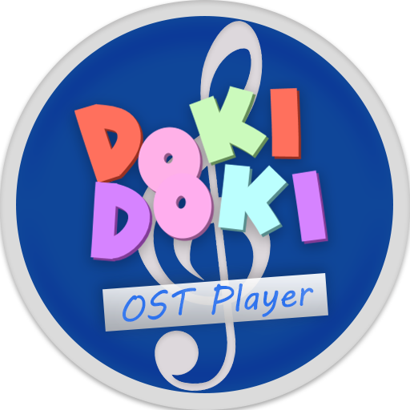

# DDLC OST Player

A built from the ground up music player for DDLC with sideloading capabilities.

[Download DDLC OST-Player Here!](https://github.com/GanstaKingofSA/DDLC-OSTPlayer/releases/latest)

    

**DISCLAIMER:** This is not affiliated nor endorsed by Team Salvato.

## What is DDLC OST Player?

This allows the user to play the mods' soundtrack alongside a players' own music outside the main story.

> All songs featured above are owned by the developer and are not included in DDLC OST Player. (Shoo music labels)

## Features

1. Ability to play MP3, OGG, WAV and OPUS files with metadata!
   > Some players will export music files differently than normal. Make sure your tracks are exported properly using your music player or Audacity.
2. Improved music player aesthetic.
3. Dynamic title, artist titles and cover art scaling.
4. Sideload songs from your playlist to be played with the mod's tracks.

## Install Steps

Refer to [here](./README_Ren'Py8.txt) for more info.

## FAQ

- Q. Can I still define songs the old classic way?

  A. No. You will have to define songs to be included using the OSTLocalTrack class instead of the old manual RPY way.

- Q. How do I add metadata info?

  A. You can add metadata to your song by using either a music player like MusicBee, MusicBrainz Picard or from your OS itself.

  - For Windows: Right-click your song, Select Properties -> Details, and fill the blank boxes you can.
  - For MusicBee: Right-Click your song within the player, select _Edit_ and edit away the info you want, then click _Apply_ then _OK_.
  - For MusicBrainz Picard: Add your song to Picard, select it, right-click the rectangle box that has 3 columns, select _Add New Tag_, select the tags you want to add like _Title_, _Artist_, _Comment_, _Album_, etc. There should be a blank box in the box area below, double-click it and edit away the info you want to add, then click _Save_ and press the _Save_ button near _Info_.

- Q. Why is Ren'Py 8 only?

  A. Scanner and a few others require Python 3.9 to function and Ren'Py 7/6 will be deprecated soon.

- Q. Why did you do this?

  A. Cause I was bored and wanted to see RWBY songs play within DDLC and see song covers displayed. (Yang _You had to 'Yang' it didn't you? :P_)

## Credits

- Nikso - Original Developer
- Sam Kujo#9403 - Original Design and Beta Tester
- Staryxz#3613 - Original Beta Tester
- PabloLuaxerc#1719 - Artist of _Wake Up Unchanged_
- Tom Rothamel - Ren'Py SDK Style Code, Ren'Py `loader.py`/`main.py` Code and Feedback
- Tom Wallroth - Tinytag Code
- RyzekNoavek#0624 - Adjustable Play Bar Code
- khaase (Pixabay) - Refresh Icon (Prior to Version 2.0)
- eugenialcala (Pixabay) - Replay Icon (Prior to Version 2.0)
- raphaelsilva (Pixabay) - Shuffle Icon (Prior to Version 2.0)
- Josy_Dom_Alexis (Pixabay) - Volume Icon (Prior to Version 2.0)
- Google - Noto Sans SC Font (Author/Description Tag) and Icons (Version 2.0+)
- Ren'Py Discord - Feedback on Ren'Py Universal Player Feats Now In DDLC OST-Player
- Weiss Schnee - Support (Weiss Finally! Some recognition! :D)

Copyright © 2020-2024 Bronya Rand (Bronya-Rand). All rights reserved.
