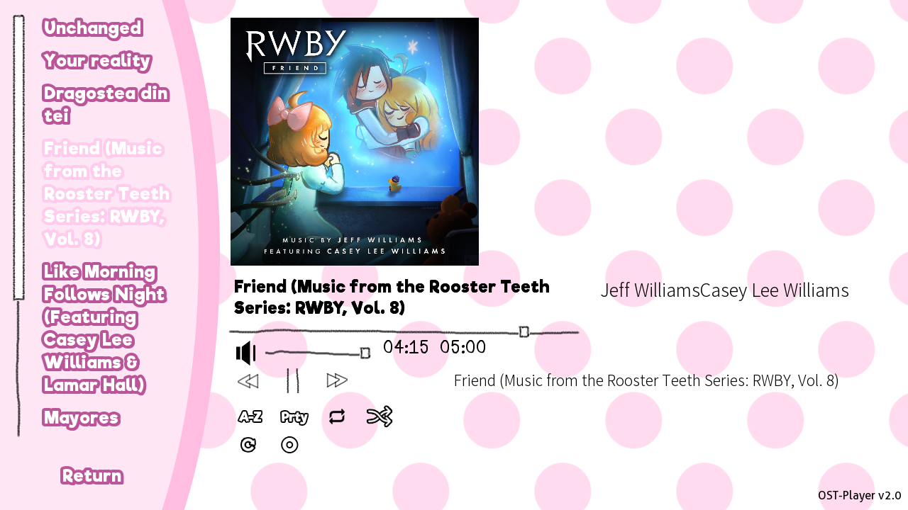

# DDLC-OSTPlayer
A heavily revamped version of Nikso's Soundtrack Player for DDLC. <u>Current Version:</u> [**1.32**](https://github.com/GanstaKingofSA/DDLC-OSTPlayer/releases/latest)



**DISCLAIMER:** This is not afiliated or endorsed by Team Salvato or Nikso. The Scattered Stars Logo in `Wake Up Unchanged` is not free to use but is only allowed in this build as a showcase display to the soundtrack player. If you plan to use this, remove it in your final build.

> Music Disclaimer: All songs featured above are owned by the developer either digitally or in CD format and are not included in DDLC-OSTPlayer. (Shoo UMG, SME and all other major labels.)

## Credits
* Nikso - Original Developer
* Sam Kujo#9403 - Original Design and Beta Tester
* Staryxz#3613 - Original Beta Tester
* PabloLuaxerc#1719 - Artist of `Wake Up Unchanged`
* Tom Rothamel - Ren'Py SDK Style Code
* RyzekNoavek#0624 - Adjustable Play Bar Code
* khaase (Pixabay) - Refresh Icon
* eugenialcala (Pixabay) - Replay Icon
* Weiss Schnee - Support (Weiss :D)

## What does this do?
This allows the user to play the soundtrack of mods outside the main story, sideload actual music to play along with the mod OST or mod authors automatically adding their songs and having them display on the player.

## What does this version improve on?
- Added MP3 compatibility to be read and played.
- Improved music progress capability and music player aesthetic.
- Dynamic title and font size changes (sort of) and Dynamic Cover Art Scaling (no need to descale art to 350x350, scale it even higher!).
- Metadata support for songs.
- Sideloading songs from your playlist to a directory if available in a mod.
- Forward and Rewind back a song in progress.
- Refresh Song List Support.
- Sorting from within the player.
- Replay support

## What do I need to run this?
1. Copy of DDLC (New Blank Copy from [DDLC.moe](https://ddlc.moe)
2. This ZIP [file](https://github.com/GanstaKingofSA/DDLC-OSTPlayer/releases/latest) with the `game` folder inside.

**Note:** If you already have Nikso's Audio Player installed in your mod and are upgrading to this one, copy the ZIP contents from the game folder to your mod's game folder **and** delete the `audio_player.rpy` file from within within `mod_assets`.

3. **(Optional)** Custom Music in a folder called `track` in the `game` folder
    * You can change this folder name or path to something else if you like. If you plan to do so, replace the phrase `track` to something else.
    > Do let people knowing that you changed it if they want to sideload songs to it.

## How do I install this?
* Drop all the contents in this ZIP file to the base folder where DDLC.exe/DDLC.sh is.
> If you are on MacOS/OS X, you must right-click DDLC.app and click `Show Package Contents` then navigate to `Contents/Resources/autorun` and drop the ZIP file contents in there.

## How do I access the player?
Copy this line to screens.rpy under lines `443-478` and restart DDLC.

```python
if main_menu:
    textbutton _("OST Player") action [Show("music_player"), SetMute("music", True), SetMute("music_player_mixer", False), SetVariable("current_soundtrack", False), If(renpy.game.preferences.mute.get("music", False), true=SetVariable("music_was_muted_before_soundtrack_player_opened", True), false=SetVariable("music_was_muted_before_soundtrack_player_opened", False)), Function(refresh_list)]
```

## Can I still define songs the old way?
Yes you can. The old format still works despite the revamp however you must add this line after defining it.
```
manualDefineList.append(Wake_Up_Unchanged) # change Wake_Up_Unchanged to your song variable
```

## How do I priortize a song or make a song the first one?
Set organizePriority to True and set the song priority by a value. 0 is the highest priority you can make a song be while 1, 2, etc. will be prioritzed lower in the list. i.e. `0 > 1 > 2 > ...`

## How do I organize the list alphabetically?
Turn on the A-Z Priority in the music player when playing a song or default it on, by setting `organizeAZ` to True.

## Can the organizations work together?
Yes. See the following organization images below.

* [Priority Organization](assets/screenshot0006.png)
* [A-Z Organization](assets/screenshot0007.png)
* [A-Z and Priority Organization](assets/screenshot0008.png)

## Why is there a file called `tinytag.py` in `python-packages`?
This handles the metadata of songs sideloaded or those that have metadata in the game.

## How do I add a description to a metadata file to explain my song?
Right-click your song, Select Properties -> Details, Double-Click the Box near Comments and type it in.
Alternatively, use [MusicBee](https://www.getmusicbee.com/) or a similar music player, or [MusicBrainz Picard](https://picard.musicbrainz.org/) and find your song.
  * For MusicBee: Right-Click your song within the player, select `Edit` and edit away the info you want, then click `Save`.
  * For MusicBrainz Picard: Add your song to Picard, select it, right-click the rectangle box that has 3 columns, select `Add New Tag` and type `comment`. Select `comment` and there should be a blank box in the box area below. Double-click it and edit away the info you want to add, then click `Save` and press the `Save` button near `Info`.

## How do I add metadata info?
Right-click your song, Select Properties -> Details, and fill the blank boxes you can.
Alternatively, use [MusicBee](https://www.getmusicbee.com/) or a similar music player, or [MusicBrainz Picard](https://picard.musicbrainz.org/) and find your song.
  * For MusicBee: Right-Click your song within the player, select `Edit` and edit away the info you want, then click `Apply` then `OK`.
  * For MusicBrainz Picard: Add your song to Picard, select it, right-click the rectangle box that has 3 columns, select `Add New Tag`, select the tags you want to add like `Title`, `Artist`, `Comment`, `Album`, etc. There should be a blank box in the box area below, double-click it and edit away the info you want to add, then click `Save` and press the `Save` button near `Info`.

## Why did you do this?
Cause I was bored and wanted to see RWBY songs play within DDLC and see song covers displayed. (Yang *:P*)
